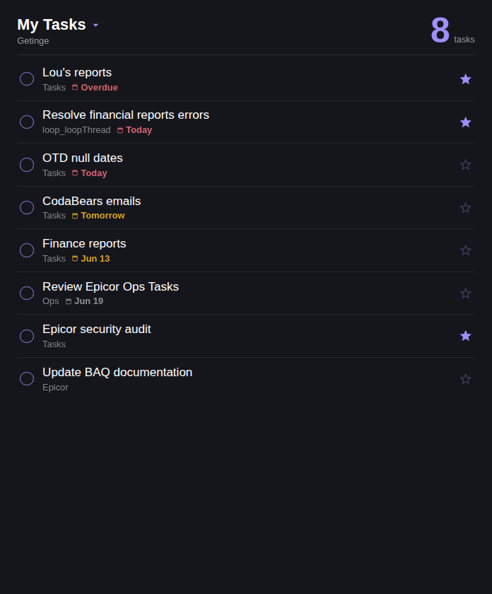

# ClickUp Tasks — iCUE Widget for Xeneon Edge

A glanceable, **My Day**-style ClickUp task list for the CORSAIR Xeneon Edge. Dark theme, circular checkboxes, due-date chips (Overdue / Today / Tomorrow), priority stars, and the list each task belongs to — designed to mirror the Microsoft To-Do Android widget aesthetic.



## Features

- **Direct ClickUp API connection** — no companion service needed; just your personal API token
- **Interactive (touch)**:
  - Tap the **header** → reveal the filter bar and toggle which **statuses** and **priorities** to show (multi-select chips)
  - Tap a task → details view with description, due date, priority, tags, and the list's status pills — tap a pill to change the task's status (PUT to ClickUp)
  - Tap a task's circle → quick-complete with a 3-second **Undo** toast before it commits
  - Task list scrolls by touch when it overflows
- **My Tasks mode** (default): every open task assigned to you across the workspace, ordered by due date then priority
- **List mode**: point it at a single ClickUp list via List ID
- **Filters**:
  - **Due**: all open tasks, due today + overdue, or due this week
  - **Priority**: in-widget multi-select chips (Urgent / High / Normal / Low / None), seeded by a **Priority (default)** setting (All / Urgent only / High and up / Normal and up)
  - **Status**: in-widget multi-select chips built from your tasks' actual statuses. In **List mode** the chips follow the list's configured status order. A **Default Status** setting (a status name, e.g. `In-Progress`; blank = all) chooses which chips start selected
  - Chips are independent toggles — selecting none *or* all of a row means "show everything" for that row; an accent dot by the header shows when a filter is narrowing the list
- **Due chips**: red *Overdue*, pink *Today*, amber *Tomorrow / this week*, muted dates beyond
- **Priority stars**: filled accent star for `urgent` / `high` tasks
- **Offline resilience**: keeps showing the last good data with an `offline` tag if the network drops
- **Responsive**: all Xeneon Edge slot sizes — S/M/L/XL, horizontal (multi-column on L/XL) and vertical
- **Personalization**: text/accent/background colors, background image with glass blur, transparency

## Installation

### With the iCUE Widget CLI

```
icuewidget validate icue-widget-clickup
icuewidget package icue-widget-clickup
```

Double-click the produced `.icuewidget` file to install into iCUE (5.44+).

### Manual (development)

Copy this folder into your iCUE widgets directory and restart iCUE.

## Setup

1. In ClickUp: avatar → **Settings** → **Apps** → copy your **API Token** (starts with `pk_`)
2. In iCUE: add the widget to a Xeneon Edge slot → open widget settings → paste the token into **ClickUp API Token**
3. Optional: set a **List ID** (the number in a ClickUp list URL) to show one list instead of all assigned tasks

## Settings

| Setting | Type | Default | Description |
|---------|------|---------|-------------|
| ClickUp API Token | text | — | Personal token (`pk_…`) |
| List ID | text | empty | Blank = all tasks assigned to you |
| Title | text | `My Tasks` | Header label |
| Show | dropdown | All open tasks | All / Due today + overdue / Due this week |
| Priority (default) | dropdown | All priorities | Seeds the priority chips: All / Urgent only / High and up / Normal and up |
| Default Status (blank = all) | text | `In-Progress` | Status name(s) to pre-select (comma-separated). Blank or no match = all selected |
| Max Tasks | slider | 12 | 3–30 |
| Refresh Interval | slider | 5 min | 1–30 min |
| Text / Accent / Background Color | color | white / `#9f8fff` / `#15161c` | |
| Background Image + Glass Blur | media | — | Optional backdrop |
| Background Transparency | slider | 100% | 0 = desktop shows through |

## States

- **Loading** — spinner while fetching
- **Setup** — no token configured; shows where to find one
- **Empty** — "All clear" when there are no open tasks at all
- **Filtered to zero** — when tasks exist but the active filters hide them all, the list shows an inline "No tasks match the current filters" note and the filter bar stays open so you can adjust
- **Error** — invalid token or network failure (falls back to last good data when possible)

## Privacy

The widget talks **only** to `https://api.clickup.com` over HTTPS using your token (GET for reading, PUT only when you change a status). No other endpoints, no analytics, no storage outside iCUE widget settings.

## Roadmap

- Tag / space filters (status + priority filters shipped in v1.2.0)
- Create task from the widget

## License

MIT — see [LICENSE](LICENSE).
